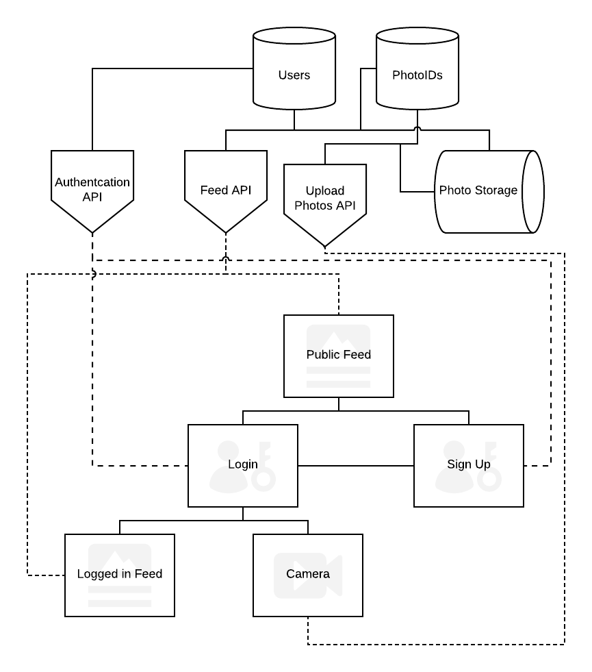

# CP476_PikPak

## Decription

An app that allows users to take photos and upload them to a shared location based feed.
Images are deleted after 24 hours
Users can see photos uploaded by other anonymous users in the last 24 hours on the shared feed.

## Target Users

### Demographics
Teens, Young Adults
### Interests
Photographers, Artists, Food, Sight seeing
### Technical Abilities
Low, Can opperate phone camera, Can opperate web browser

## Pages
### Login
The login page will ask for a username and password or allow user to login via a federated identity provider (Google, Facebook, etc...) that they previously configured
### Signup
The Signup page will ask a user to create a new account with a username and password and a captcha for spam prevention.
### Settings
The Settings page will allow users to modify their preferences such as: Explicit image filtering, Favourite tags, etc...
### Public Feed
The feed that is available for everyone to view. Filters out NSFW content.
Users who uploaded the content are remained anonymous.
### Logged in Feed
The feed that a logged-in user can view. User has the ability to upvote and downvote photos.
Users can filter photos by newest or most popular post, and can choose whether or not to see NWFW content.
Sorts photos based on user preferred tags.
Users who uploaded the content are remained anonymous.
### Camera
Allows users to take pictures on their phone and upload it to the feed. Users can tag the photos and save it to their phone.
## APIs
### User Settings
Allows authenticated users to modify and retrieve settings
### Authentication
Authenticates users
### Feed
Returns images for a given search query and user information
### Upload Photos
Allows authenticated users to upload photos with tags. Checks for NSFW content
### Users
Database to store users and settings
### PhotoIDs
Database of all photos currently stored with tags and location data
## Photo Storage
Storage for raw images to be served
## Flowchart

## Milestones

### Creating the UI design - Feb 3rd
- drawing a mock-up of the website
### Implementing the UI - Feb 9th
- creating the front-end
### Implementing the API's - Feb 9th
- getting back-end and API's to work
### Combining both front-end and back-end - Feb 16th
- getting front-end and back-end to work together
### Revision - Feb 23rd
- fixing things that don't work
### First Draft for Presentation - March 16 th
- prepare for our presentation
### Final Draft for Project Files and Documents - March 30th
- fix up and finalize our project
